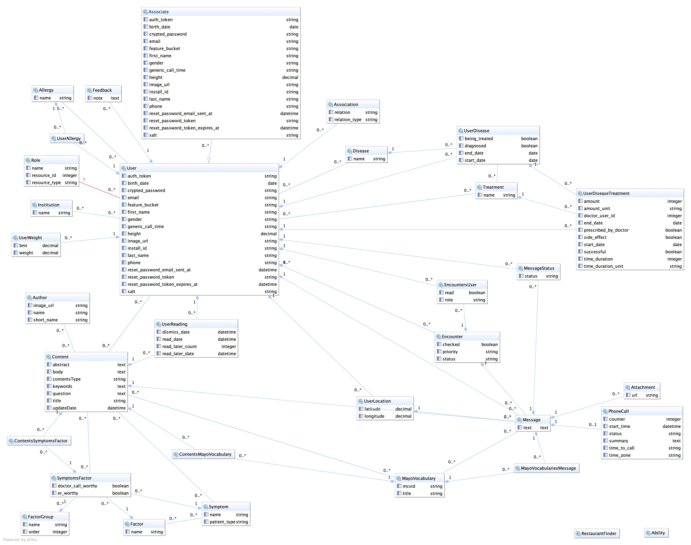

#Better Rails Server  


This project includes:

1. Better App API + docs
2. Nurse Portal


##Environments
####Development
* Database: Sqlite
* Rails 3.2.11
* ruby-1.9.3

To generate API docs run
```
rake docs:generate
```

####Staging
[rhs-staging.herokuapp.com](http://rhs-staging.herokuapp.com)

(request access to project from [Geoff Clapp](geoff.clapp@gmail.com))

* Database: Postgres

To deploy run 
```
git push heroku master
```

#####To add roles to users
```
heroku run rails console
```
in console

```
u = User.where(:email=>"geoff.clapp@gmail.com")
u.add_role :hcp
```

####Alpha
[rhs-alpha.herokuapp.com](http://rhs-alpha.herokuapp.com)

(request access to project from [Geoff Clapp](geoff.clapp@gmail.com))

* Database: Postgres

To deploy run 
```
git push heroku alpha
```

##Data Models



##Notes

** Heroku is case sensitive for directories. **

** Solr needs extra changes on config to make partial word searches possible. **
> change schema.xml to contain this chunk. <fieldType name="text" class="solr.TextField" omitNorms="false"> is already there, but the stuff under that directive need to merged.

```
 <fieldType name="text" class="solr.TextField" omitNorms="false">
      <analyzer>
        <tokenizer class="solr.StandardTokenizerFactory"/>
        <filter class="solr.StandardFilterFactory"/>
        <filter class="solr.LowerCaseFilterFactory"/>
        <filter class="solr.NGramFilterFactory" minGramSize="2" maxGramSize="15"/>
      </analyzer>
      <analyzer type="query">
        <tokenizer class="solr.StandardTokenizerFactory"/>
        <filter class="solr.StandardFilterFactory"/>
        <filter class="solr.LowerCaseFilterFactory"/>
      </analyzer>
    </fieldType>
```


